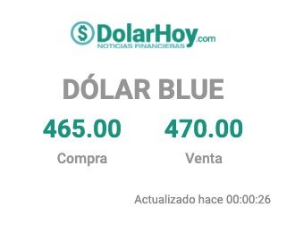

# USD-ARS Screenshot embedded

Manda las cotizaciones de [dolar hoy, blue](https://dolarhoy.com/i/cotizaciones/dolar-blue) por webhook Discord como una imagen embebida.
> Requiere chrome instalado ya que utiliza esto para tomar la screenshot, por lo que no funciona en todos lados.

## Envs

*WEBHOOK_URL*: Obviamente el webhook que requiere para mandar la notificaicon

## Docker / Kubernetes

Se puede bajar tal cual esta y compilar con los valores deseados, utilizar el yaml que dejo aca para que corra como cronjob en kubernetes o usar esta imagen `quay.io/agustinlare/usdarsrate`.

docker run -e WEBHOOK_URL="<WEBHOOK>" -itd quay.io/agustinlare/usdarsrate:screenshot

## Ejemplo
